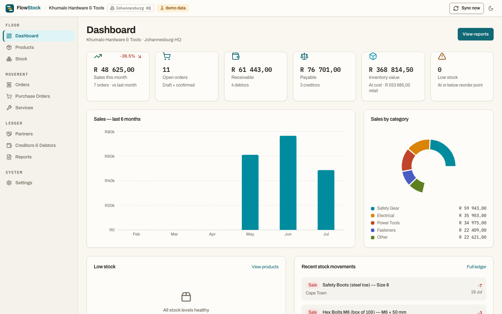
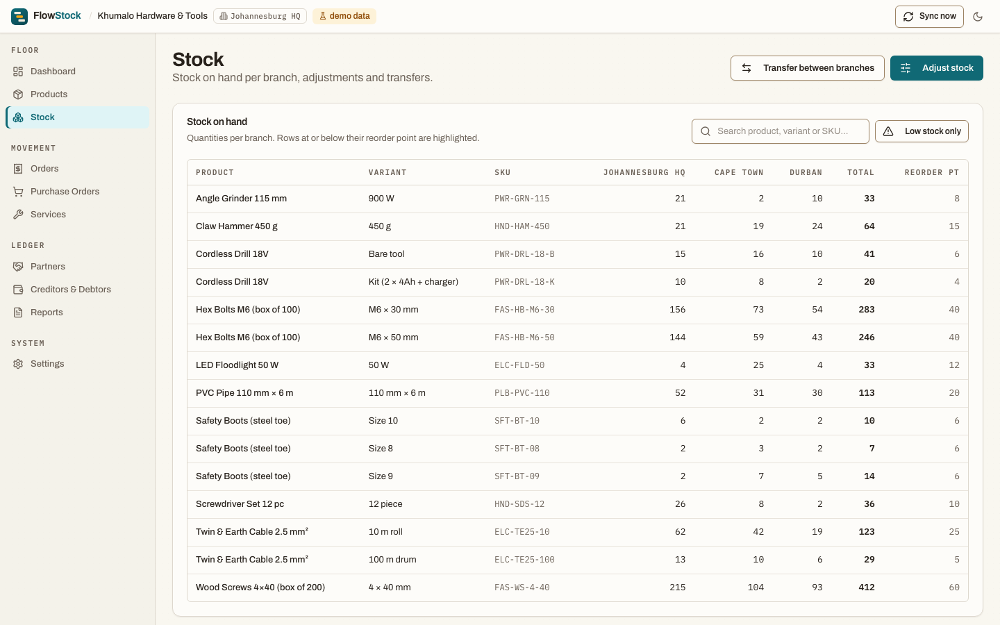
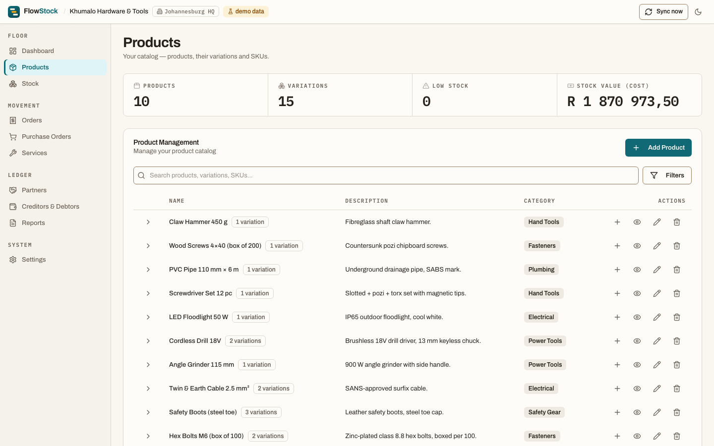
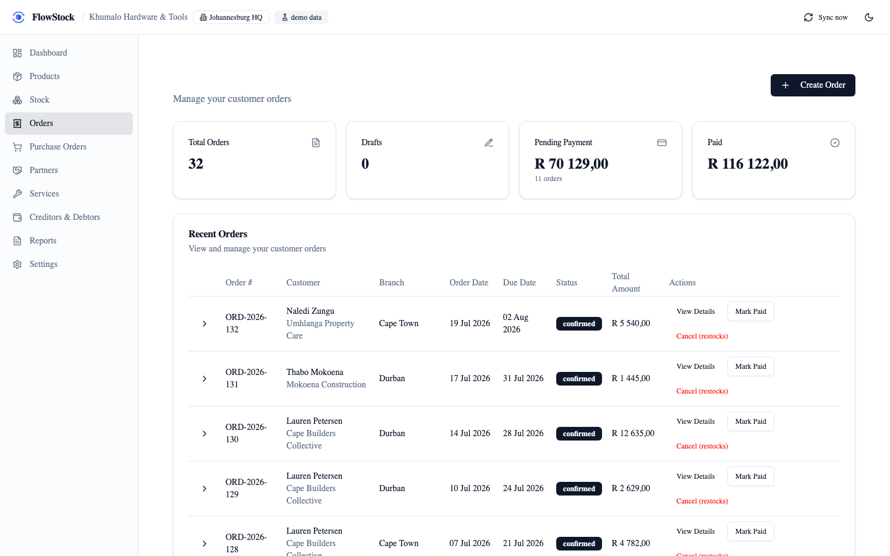
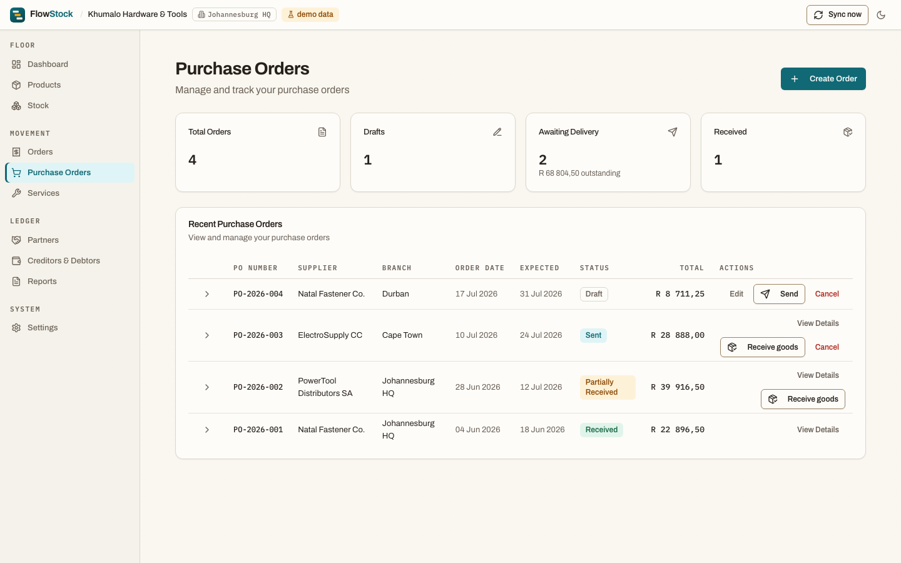
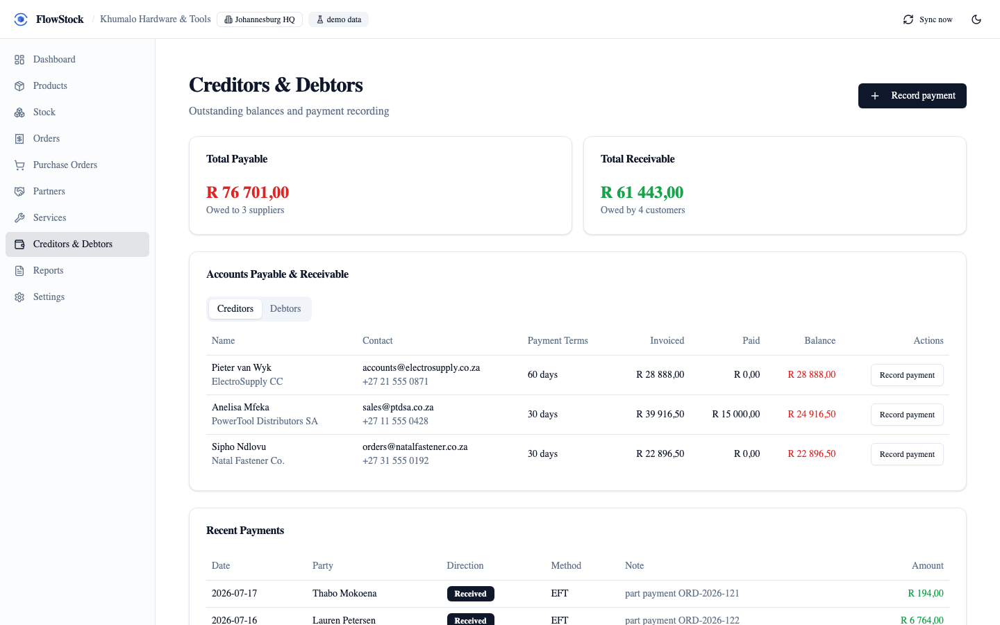
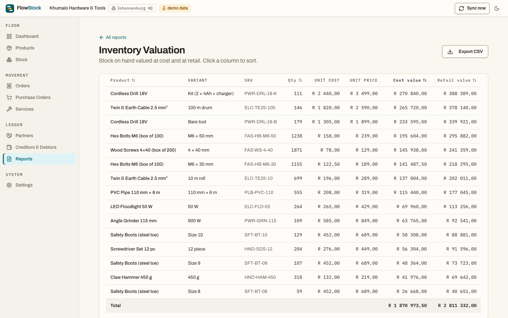
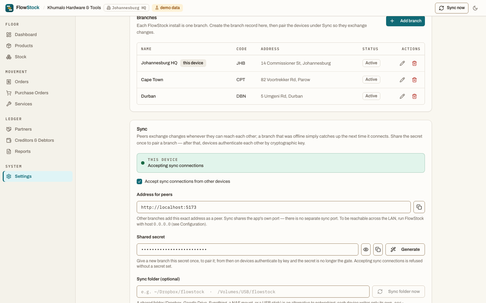
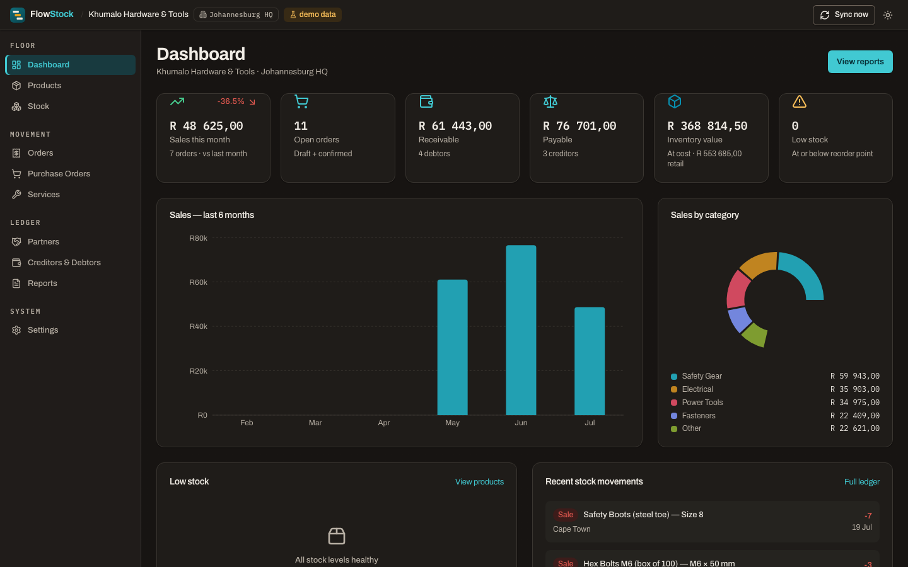
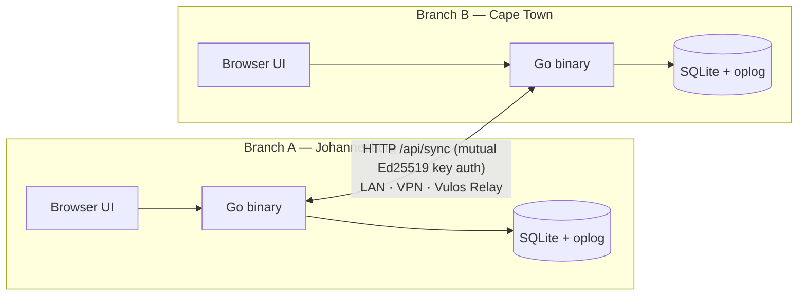

<div align="center">


**Offline-first inventory for multi-branch businesses.**<br>
Products, stock, orders, purchasing, and accounts — in one self-hosted binary
that keeps every branch in sync, even when branches go offline.

[](LICENSE-MIT)
[](CHANGELOG.md)
[](https://golang.org)
[](https://react.dev)

_Vulos — rooted in **vula**, the Zulu and Xhosa word for **open**._



</div>

---

## What is FlowStock?

FlowStock is a free, open-source inventory and stock-control app for small
multi-branch businesses — shops, hardware stores, wholesalers, workshops. It is
a **single Go binary** that serves a web UI and stores everything in a local
SQLite database: no cloud account, no subscription, no external services. Each
branch runs its own copy, works fully offline, and syncs **peer-to-peer** with
the other branches over the LAN, a VPN, or a tunnel whenever they can reach
each other. There is no central server. Stock is an append-only ledger, so
branches that traded while disconnected always converge to the same totals.

## Features

- 📦 **Products & variations** — categories, SKUs, price + cost price,
  attributes, reorder points
- 🏪 **Multi-branch stock ledger** — stock on hand per branch, derived from
  immutable movements (never a mutable counter)
- 🔄 **Leaderless offline-first sync** — hybrid-logical-clock oplog; catalog
  merges last-writer-wins, stock movements + goods receipts merge by union; any
  topology (pair, hub-and-spoke, mesh); authenticated, fail-closed
- 🧩 **Merges with the shared DMTAP Sync engine** — FlowStock does not carry a
  private CRDT any more. Conflicts are resolved by the Vulos suite's one
  specified, vector-verified implementation of
  [`substrate/SYNC.md`](https://github.com/vul-os/dmtap) — the *same compiled
  engine* Ofisi runs, not a second implementation that agrees most of the time.
  Every op is individually signed, so a replicated change is verified on its own
  rather than trusted for arriving over an authenticated connection. Nodes
  advertise their merge engine in the handshake and refuse to sync across a
  mismatch, because two algebras in one mesh converge only by luck
- 🏷️ **Self-describing workspaces** — every row and op carries a workspace
  `org_id`; cross-workspace ops are rejected, and a new device _pairs in_ by
  adopting the workspace rather than starting its own
- 📁 **Folder sync (no network needed)** — replicate through Dropbox, Google
  Drive, Syncthing, a NAS, or a **USB stick** (sneakernet); each device writes
  only its own append-only file, so file-sync never conflicts
- 🗜️ **Bounded history** — one-click compaction writes a checksummed, signed
  snapshot and prunes ops every branch has acknowledged
- 🔑 **Mutual key-authenticated sync** — each node has an Ed25519 identity; op
  batches and snapshots are signed, and every sync request is signed and
  verified against the peer's enrolled key (±5-min freshness, replay-protected).
  The shared secret only bootstraps pairing; revoke a node by removing its peer
  row
- 🧾 **Sales orders** — draft → confirm (deducts stock) → paid; cancelling
  reverses stock; product + service line items
- 🚚 **Purchasing** — purchase orders with VAT, goods receiving with partial
  receipts (an immutable per-receipt ledger) and automatic status progression
- ↔️ **Adjustments, counts & transfers** — audited movements between branches
- 💰 **Creditors & debtors** — balances computed from orders, POs and recorded
  payments
- 📊 **Real dashboard & reports** — sales, valuation, movements, low stock,
  accounts; CSV export everywhere
- 🧪 **Demo mode** — the UI runs in a plain browser with seeded data
  (`npm run dev`), so you can try everything with zero setup
- 🌓 Light & dark themes; single ~15 MB binary; runs on a laptop, server, NAS
  or Raspberry Pi

## Screenshots

<table>
<tr>
<td><br><em>Stock — per-branch matrix + movement ledger</em></td>
<td><br><em>Products & variations</em></td>
</tr>
<tr>
<td><br><em>Orders — confirming deducts stock</em></td>
<td><br><em>Purchasing — receive goods, partial receipts</em></td>
</tr>
<tr>
<td><br><em>Creditors & debtors + payments</em></td>
<td><br><em>Reports with CSV export</em></td>
</tr>
<tr>
<td><br><em>Branch sync — peers, shared secret, status</em></td>
<td><br><em>Dark theme</em></td>
</tr>
</table>

## Quick start (standalone)

**Docker:**

```bash
docker run -p 8787:8787 -v flowstock-data:/data \
  -e FLOWSTOCK_HOST=0.0.0.0 -e FLOWSTOCK_DATA_DIR=/data \
  ghcr.io/vul-os/flowstock:latest
```

**Binary** — download from [Releases](https://github.com/vul-os/flowstock/releases):

```bash
./flowstock          # serves http://127.0.0.1:8787
```

**From source** (Go 1.25+, Node 18+):

```bash
git clone https://github.com/vul-os/flowstock.git
cd flowstock
npm install
npm run build:all    # builds the single ./flowstock binary (frontend embedded)
./flowstock
```

**Zero-setup demo** (browser only, seeded data):

```bash
npm install && npm run dev    # → http://localhost:5173
```

**Connect a second branch:** run each with `FLOWSTOCK_HOST=0.0.0.0`, set the
same sync secret on both (Settings → Sync) to pair them — after pairing they
authenticate each other by key — add the other's URL (`http://<host>:8787`) as a
peer, _Sync now_. Details in
[docs/GETTING-STARTED.md](docs/GETTING-STARTED.md).

## How it works



Every mutation is journalled to an oplog with a hybrid-logical-clock timestamp
and tagged with the workspace `org_id`. Sync exchanges ops (push + pull,
batched, idempotent, signed): catalog rows resolve last-writer-wins; **stock
movements and goods receipts are immutable and merge by union**, which is what
makes offline multi-branch stock safe. Version vectors are derived from the
oplog, so sync is stateless and any node can relay any other node's changes.
The same ops can travel over HTTP **or** a shared folder (Dropbox/Syncthing/USB),
and one-click compaction snapshots state and prunes acknowledged history.

**Which write wins is decided by the shared DMTAP Sync engine**, not by
FlowStock. Storage, transport and identity are unchanged — SQLite, the
mutual-Ed25519 HTTP pull and the folder path, the per-node key — and the
substrate supplies only the algebra: catalog rows map to its last-writer-wins
register, the two ledgers to its add-only set, which is exactly the behaviour
described above. FlowStock's own CRDT is still carried and still tested, and
`substrate_sync: false` pins a node to it. Because the two break an exact
timestamp tie differently, the merge engine is part of the sync handshake and a
round across a mismatch is refused rather than allowed to diverge in silence.
Full details in [docs/ARCHITECTURE.md](docs/ARCHITECTURE.md) and
[docs/SYNC.md](docs/SYNC.md).

## Configuration

Zero-config by default. Optional `flowstock.config.json` or env vars set the
port, bind host, data directory, an owner password, and `frame_ancestors` (for
Vulos OS embedding). Business, branches and sync are configured in-app. See
[docs/CONFIGURATION.md](docs/CONFIGURATION.md).

## Documentation

| Doc                                                | Contents                                                 |
| -------------------------------------------------- | -------------------------------------------------------- |
| [docs/GETTING-STARTED.md](docs/GETTING-STARTED.md) | install, first run, connecting branches, backups         |
| [docs/ARCHITECTURE.md](docs/ARCHITECTURE.md)       | Go binary, data model, oplog & clocks, sync protocol     |
| [docs/SYNC.md](docs/SYNC.md)                       | topologies, security, merge semantics, conflict examples |
| [docs/CONFIGURATION.md](docs/CONFIGURATION.md)     | every setting + environment variables                    |
| [docs/SCREENSHOTS.md](docs/SCREENSHOTS.md)         | regenerating the README screenshots                      |
| [docs/TESTING.md](docs/TESTING.md)                 | Go and browser test suites, running and debugging them   |

## Development

```bash
npm run dev            # UI only, browser + demo data (port 5173)
npm run dev:app        # Go server proxying to the Vite dev server
npm run build          # frontend production build
npm run build:all      # single embedded binary
npm run lint           # eslint
npm run test:go        # Go unit + HTTP sync e2e tests
npm run test:e2e       # browser end-to-end tests (Playwright)
npm test               # both suites
npm run screenshots    # regenerate docs/screenshots (Playwright)
```

The Go test suite includes real two-node tests covering the
offline-divergence → reconvergence path over HTTP and over a shared folder
(`backend/internal/sync/`), workspace isolation + pairing, concurrent
goods-receipt convergence, oplog compaction with snapshot rebuild, and the
signed-batch tamper check, plus the store's merge/ledger invariants
(`backend/internal/store/`).

### Browser tests

`npm run test:e2e` drives the **real binary** in a real browser — never the
demo data. It builds the single embedded binary (skipped when already current),
boots each instance against a throwaway data dir on a free port, and runs the
flows a shopkeeper actually walks: adding a product and variant, recording
stock, confirming an order, receiving a purchase order, and moving stock
between branches.

The centrepiece is a **two-node convergence test**: two separate processes with
separate databases are paired through the Setup screen's "Join a branch" tab,
edited while apart — including concurrent stock movements at the same branch —
then synced, with convergence asserted in _both_ browsers. A folder-sync test
proves the same thing with the network peers deleted, so only the shared
`ops-<node>.jsonl` files can carry the data.

One-time browser install:

```bash
npx playwright install chromium
```

See [docs/TESTING.md](docs/TESTING.md) for the layout, how to debug a failure,
and the conventions that keep the suite fast and non-flaky.

## Contributing

Issues and PRs are welcome. Keep changes small and focused; run `npm test`
(Go + browser) and `npm run lint` before submitting. For anything protocol-level
(oplog, merge rules, sync endpoints), open an issue first — on-disk and on-wire
compatibility matters.

## License

[MIT](LICENSE-MIT) OR [Apache-2.0](LICENSE-APACHE) — © VulOS. FlowStock is a VulOS
project; source and issues at [github.com/vul-os/flowstock](https://github.com/vul-os/flowstock).

---

<p align="center">
  <a href="https://vulos.org"></a><br>
  <sub><a href="https://vulos.org"><b>vulos</b></a> — open by design</sub>
</p>
